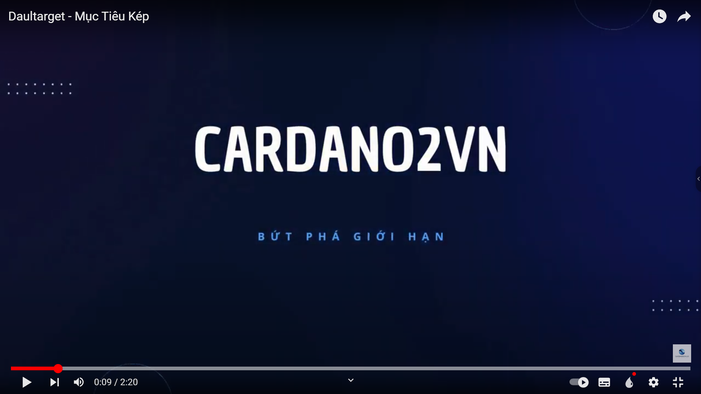

<div style="text-align:center">
   <h2>Dualtarget for ADA-Holders (Staking and increasing assets) with a decentralized automated trading bot</h2>
</div>

<div style="text-align:center">
    
</div>

## Project folder structure

1. apps: Manage routes using a directory structure. Instead of complicated configuration, you just need to create directories and files to define routes.
2. assets: Contains project resources including video icon images and fonts.
3. components: Used to organize and manage application components.
4. configs: Configure paths for wallet settings and project routes.

-   wallets.ts:
-   routes.ts: Definition of absolute project routes

5. constants
6. contexts
7. Data
8. Helpers
9. Hooks
10. Layouts
11. Libs
12. routers: Define names and routes of routers in the project (for public routers)
13. Services
14. Styles
15. Transactions
16. Types
17. Utils

## Instructions for use

[](https://www.youtube.com/watch?v=DCWY93O_QAU&t=1s "Everything Is AWESOME")

## Installation Instructions

### 1. Please clone this source code

In this project, nextjs is used as the main frontend framework to perform construction and development. In this guide there will be some requirements to show you how to develop products using git to clone the project.

Before starting the project you need to have git. If you don't have git yet, download git by clicking the link below before going to the next part.

```sh
https://git-scm.com/downloads
```

Then you check out git with the command `git --version` trong terminal

```
$ git --version
> git version 2.41.0.windows.3
```

Then use commands clone the project from github

```sh
git clone https://github.com/independenceee/dualtarget.git
```

Then use commands to go to the directory of the current dualtarget frontend

```sh
cd dualtarget/frontend
```

### 2. Project settings

In this tutorial we will show you 2 ways to run our project on the frontend Through `docker` or run setup using `nodejs`. When setting up the project you need to set environment variables for the project in the file `next.config.mjs`. If you don't have an API, you can download blockfrost's API to use its API

```ts
const nextConfig = {
    env: {
        // MAINNET NETWORK
        BLOCKFROST_NETWORK_NAME_MAINNET: "Mainnet",
        BLOCKFROST_RPC_URL_MAINNET:
            "https://cardano-mainnet.blockfrost.io/api/v0",
        BLOCKFROST_PROJECT_API_KEY_MAINNET:
            "mainnettClW67e7zjxBTdjgynNwmGsvyz5DCMmC",
        KOIOS_RPC_URL_MAINNET: "https://api.koios.rest/api/v1",
        NEXT_APP_BASE_URL_MAINNET: "https://api.dualtarget.vn/api/v1",
        DUALTARGET_CONTRACT_ADDRESS_MAINNET:
            "addr_test1zze6xz2yuzcwkt4f7kpyr4yt82xkq2kkmfj0vv54fz4kwy3a39atxwxg8ks578mqpxpsgsetvu8hx5f9nhvercv4da7s5s9p98",
        DUALTARGET_PAYMENT_ADDRESS_MAINNET: "",
        DUALTARGET_STAKE_ADDRESS_MAINNET: "",
        EXCHANGE_ADDRESS_FREE_MAINNET:
            "ecc575c43fe93b158e02a176c9159afe681cd097910748fde50d33a7",
        POOL_ID_MAINNET:
            "pool1rqgf6qd0p3wyf9dxf2w7qcddvgg4vu56l35ez2xqemhqun2gn7y",
        MIN_TOKEN_ASSET_MAINNET: "",
        DJED_TOKEN_ASSET_MAINNET: "",
        // PREPROD NETWORK
        BLOCKFROST_NETWORK_NAME_PREPROD: "Preprod",
        BLOCKFROST_RPC_URL_PREPROD:
            "https://cardano-preprod.blockfrost.io/api/v0",
        BLOCKFROST_PROJECT_API_KEY_PREPROD:
            "preprodUsPqIO1ocp09iUg3TwM2aZcKaEa9ygtn",
        KOIOS_RPC_URL_PREPROD: "https://preprod.koios.rest/api/v1",
        NEXT_APP_BASE_URL_PREPROD: "https://preprod.dualtarget.vn/api/v1",
        DUALTARGET_CONTRACT_ADDRESS_PREPROD:
            "addr_test1zze6xz2yuzcwkt4f7kpyr4yt82xkq2kkmfj0vv54fz4kwy3a39atxwxg8ks578mqpxpsgsetvu8hx5f9nhvercv4da7s5s9p98",
        DUALTARGET_PAYMENT_ADDRESS_PREPROD: "",
        DUALTARGET_STAKE_ADDRESS_PREPROD:
            "stake_test1uq7cj74n8ryrmg20rasqnqcygv4kwrmn2yjemkv3ux2k7lgqu950l",
        EXCHANGE_ADDRESS_FREE_PREPROP:
            "ecc575c43fe93b158e02a176c9159afe681cd097910748fde50d33a7",
        POOL_ID_PREPROD:
            "pool1ke9h4mggr8ttf45ale5dv4ntkvuw2wkvm6la4mv02688xuy99qp",
        MIN_TOKEN_ASSET_PREPROD:
            "e16c2dc8ae937e8d3790c7fd7168d7b994621ba14ca11415f39fed724d494e",
        DJED_TOKEN_ASSET_MAINNET: "",

        // BINANCE_API_KEY: "V0popsaVcPSajStISK7DRkZsYOgMEqnlFoDwejiy28gsDMZ4Uj6Ohrr3vIxdAlby",
        // BINANCE_API_SECRET: "nItpNsxBjIgePDYGAgZ9iiMUlK1LwLLwOs4776B9vbf5HLmDm61TsT5hC9w1nrpg",
    },
};

export default nextConfig;
```

To get these resources you need to `https://blockfrost.io` and `https://www.koios.rest` to do a few operations to get all the dependencies for the project.

#### Using `Docker`

When you want to setup a project using Docker, you must have Docker. If you do not have Docker, download Docker to your environment to run the project. `https://www.docker.com`

```sh
$ docker --version
> Docker version 24.0.7, build afdd53b
```

Into the project directory `docker compose up --build` to use docker to run the project

```sh
$ run docker compose up --build

[+] Running 2/2
 ✔ Network frontend_default         Created                                                                                                            0.0s
 ✔ Container frontend-dualtarget-1  Created                                                                                                            0.1s
Attaching to dualtarget-1
dualtarget-1  |
dualtarget-1  | > dual-target-frontend@0.1.0 start
dualtarget-1  | > next start
dualtarget-1  |
dualtarget-1  |    ▲ Next.js 14.1.0
dualtarget-1  |    - Local:        http://localhost:3000
dualtarget-1  |
dualtarget-1  |  ✓ Ready in 400ms
```

The successfully installed project needs to be up and running on PORT:3000

### Using `NodeJS`

This tutorial requires you to have nodejs. If you don't have it yet, install nodejs. Along with nodejs, npm and npx need to check the existence of these two packages before going to the next part.

```sh
https://nodejs.org/en
```

Then install the project using `npm install` to get the necessary resources for the project

```sh
npm install
```

after the installation is done successfully use `npm run dev` to run the project

```sh
$ npm run dev
> dualtarget-frontend@1.0.0 dev
> ts-node src/index.ts
http://localhost:3000
```

The project is running on `PORT 3000` and now you will carry out development of our project. After the project is built successfully, execute `npm run build` to build and check the output and `npm run start` to start the project production

## License

The Dualtarget is released under the MIT. See the LICENSE file for more details.

## Contact

For any questions or feedback, please contact the project maintainer at `nguyenkhanh17112003@gmail.com`.
